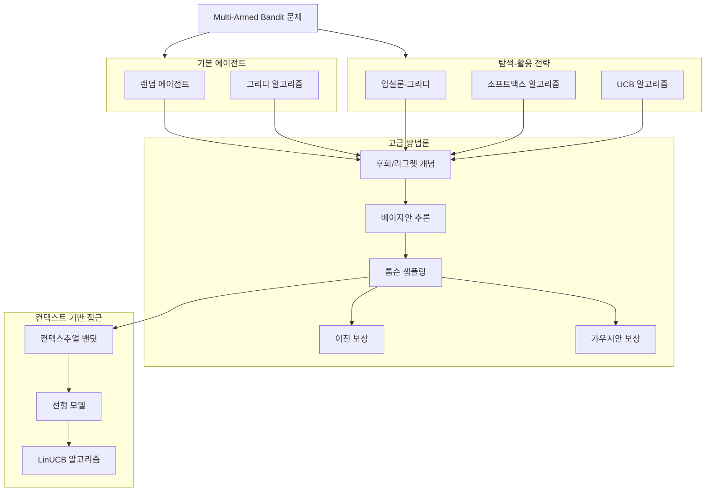

<<<<<<< HEAD
# mab_study
=======
# Multi-Armed Bandit Algorithm Implementation

## 개요

이 저장소는 Multi-Armed Bandit (MAB) 알고리즘의 기본 개념부터 Contextual Bandit까지의 다양한 구현을 포함합니다. 알고리즘의 학습 경로와 구현은 다음과 같은 구조로 구성되어 있습니다:

## 구조

이 저장소는 다음과 같은 주요 모듈들을 포함합니다:

### 1. Basic Agents (`mab_basic_agent.py`)
- 랜덤 에이전트
- 그리디 알고리즘
- 입실론-그리디 알고리즘
- 소프트맥스 알고리즘
- UCB(Upper Confidence Bound) 알고리즘
- 후회/리그렛 측정 기능

### 2. Thompson Sampling (`mab_thompson_sampling.py`)
- 베이지안 추론 기반 접근
- 이진 보상을 위한 베타 분포 구현
- 가우시안 보상을 위한 정규 분포 구현

### 3. Contextual Bandit (`mab_contextual_agent.py`)
- 선형 모델 구현
- LinUCB 알고리즘
- 컨텍스트 처리 유틸리티

## 참고 자료

- Contextual Multi-Armed Bandit Problems in Python by Hadi Aghazadeh (Udemy Course) 
- A Contextual Bandit Bake-off: https://arxiv.org/abs/1802.04064
- A Contextual-Bandit Approach to Personalized News Article Recommendation: https://arxiv.org/abs/1003.0146
- A Tutorial on Thompson Sampling: https://arxiv.org/abs/1707.02038
>>>>>>> cf4c782 (Add README and MAB implementation)
